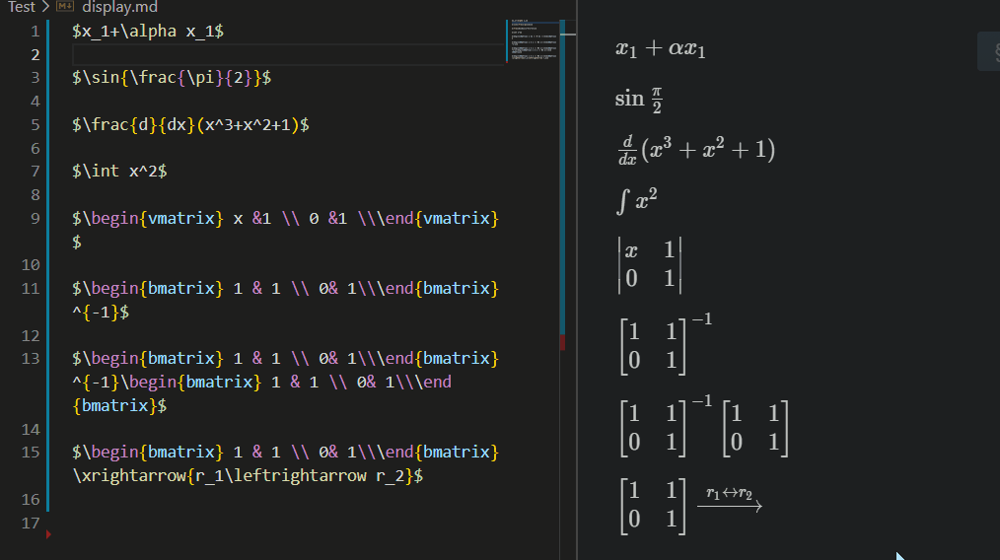
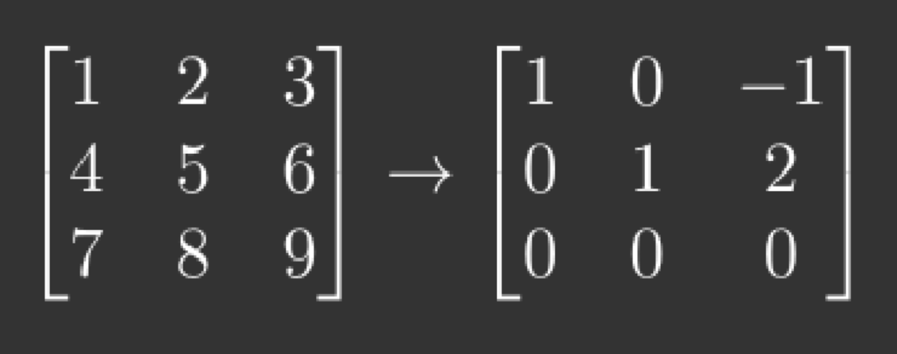

# Latex Sympy Calculator

## About

`Latex Sympy Calculator` parses **LaTeX math expressions** and converts it into the equivalent **SymPy form**. Then, **calculate it** and convert to latex result. 

It is designed for providing **people writing in latex or markdown** a ability to calculate something when writing math expression. It is based on `Python`, `Sympy` and [`latex2sympy2`](https://github.com/OrangeX4/latex2sympy) module.

PS: If you want to install the extension, **PLEASE READ THE INSTALL DESCRIPTION!**



## Features

* **Arithmetic:** Add (+), Sub (-), Dot Mul (·), Cross Mul (×), Frac (/), Power (^), Abs (|x|), Sqrt (√), etc...
* **Alphabet:** a - z, A - Z, α - ω, Subscript (x_1), Accent Bar(ā), etc...
* **Common Functions:** gcd, lcm, floor, ceil, max, min, log, ln, exp, sin, cos, tan, csc, sec, cot, arcsin, sinh, arsinh, etc...
* **Funcion Symbol:** f(x), f(x-1,), g(x,y), etc...
* **Calculous:** Limit ($lim_{n\to\infty}$), Derivation ($\frac{d}{dx}(x^2+x)$), Integration ($\int xdx$), etc...
* **Linear Algebra:** Matrix to raw echelon form, Determinant, Transpose, Inverse, Elementary Transformation, etc...
* **Other:** Binomial...

## Install

**IT IS IMPORTANT!**  
**IT IS IMPORTANT!**  
**IT IS IMPORTANT!**  

Before you use the extension, please install python and two python modules: `latex2sympy` and `Flask`.

Install **Python** in [Python.org](https://www.python.org/), and then install **NECESSARY modules** by running:

```
pip install latex2sympy2
pip install Flask
```

If you have installed it, you can run the code in terminal to test if you have installed it successfully.

```
python

# Get into python environment
import latex2sympy2
import flask
```

If you want to use this extension in `Remote - SSH` or `Remote - WSL`, please **uninstall the original extension** and reinstall it in the remote server.

## Usage


### Latex to Latex

You can **SELECT** some text, and press `Shift + Ctrl + Alt + E` (equal) to get the result of the selected Latex text. It will be like:

``` latex
# Before
\frac{d}{dx}(x^3+x^2+1)

# After
\frac{d}{dx}(x^3+x^2+1) = x (3 x + 2) 
```

You can **SELECT** some text, and press `Shift + Ctrl + Alt + R` (replace) to get the result of the selected Latex text. It will be like:

``` latex
# Before
\frac{d}{dx}(x^3+x^2+1)

# After
x (3 x + 2) 
```

### Factor and Expand

You can **SELECT** some text, and press `Shift + Ctrl + Alt + F` (factor) to get the factor of the selected Latex text. It will be like:

``` latex
# Before
x^{2} + 2 x y + y^{2}

# After
(x + y)^{2}
```

If you are using **windows**, the shortcut `Shift + Ctrl + Alt + F` may be invalid, you can set another shortcut for it.

You can **SELECT** some text, and press `Shift + Ctrl + Alt + X` (expand) to get the expand of the selected Latex text. It will be like:

``` latex
# Before
(x + y)^{2}

# After
x^{2} + 2 x y + y^{2}
```

### Latex to Numerical Result

You can **SELECT** some text, and press `Shift + Ctrl + Alt + N` (numerical) to get the numerical result of the selected Latex text. It will be like:

``` latex
# Before
\sqrt{2}

# After
1.41421356237310
```

### Solve Equation

``` latex
# Before
x + y = 1

# After
[ y = 1 - x, \  x = 1 - y]
```

### Eval At

``` latex
# Before
(x+2)|_{x=y+1}

# After
y + 3
```

### Matrix to raw echelon form

You can **SELECT** matrix, then press `Shift + Ctrl + Alt + T` to transform it to raw echelon form in one action
``` latex
# Before
\begin{bmatrix}
    1 & 2 & 3\\
    4 & 5 & 6\\
    7 & 8 & 9
\end{bmatrix}

# After 
\begin{bmatrix}
    1 & 2 & 3\\
    4 & 5 & 6\\
    7 & 8 & 9
\end{bmatrix} \to \begin{bmatrix}1 & 0 & -1\\0 & 1 & 2\\0 & 0 & 0\end{bmatrix}
```


## License

This project is licensed under the MIT License.
